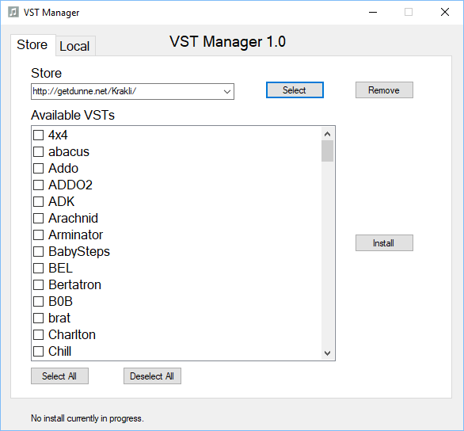
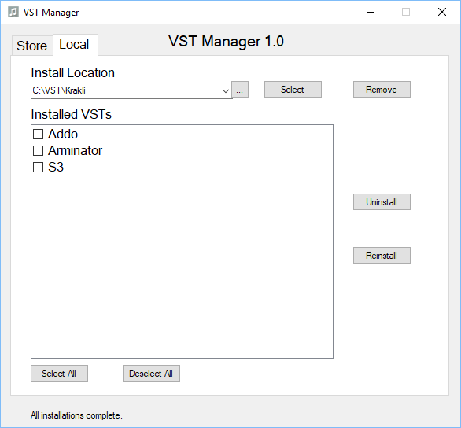

# VST Manager #

VST Manager is a program which automates the process of downloading and installing [VST plug-ins](https://en.wikipedia.org/wiki/Virtual_Studio_Technology "VST plug-ins") from specially-crafted web sites called "VST Stores". (VST is a trademark of [Steinberg Media Technologies GmbH](https://www.steinberg.net "Steinberg").)

For example, browse to the VST Store at [http://getdunne.net/Krakli/](http://getdunne.net/Krakli/). This web site presents information about a large number of free VST plug-ins. There is a page for each plug-in, which includes a screen shot image, some additional information, and a download link. To install a VST, you need to find and then click its download link, then locate the downloaded .zip archive, unzip it, and move the files to wherever you keep VSTs.

Using VST Manager, you would start by entering the store URL into the "Store" box and clicking the "Select" button. All of the VSTs available at that store would then appear in the list below, as shown in the following screen shot:

You would then browse the list to find the name of the plug-in you want, click its checkbox, and click the "Install" button. VST Manager takes care of the rest.

Of course it's not quite as simple as that, because you must also specify the folder where you want your installed VSTs to go. This is done by selecting the "Local" tab instead of the "Store" tab. You can either click the "..." button to browse to the right folder on your PC, or type the path in the box, and then click "Select". If you had already installed some plug-ins in that folder, they will appear in the list below, as shown here:

If the folder you define does not yet exist, VST Manager will ask if you want it to be created. In this way, you can easily create as many VST folders as you wish. Most DAWs have their own default VST folders, but allow you to define one or more of your own, which are then scanned to build a list of available VSTs for easy access within the DAW. Refer to your own DAW's documentation for guidance on where to keep VSTs on your system.

## Downloading and installing VST Manager ##

VST Manager is open-source software, distributed under the MIT License. If you don't want to download the source code and compile it yourself, you can download a pre-built version using [this link](http://getdunne.net/download/VSTManager.exe). There is no formal installer; you simply put the *VSTManager.exe* file wherever you want, and run it by double-clicking its icon. It's best to put it into a folder all by itself, because the program needs to create some files in that folder. Make sure to put this folder into a location where you have write privileges--your Desktop is a good choice.

## A tour through the VST Manager GUI ##

**Tabs**
Used to change between the two tabs. The Store tab is for installing VSTs from NetVST stores, and the Local VST is for managing installed VSTs.

**"No install currently in progress" text**
Used to keep track of installations, and the text will change depending on the progress of the installation.

**Store tab - Store box**
Enter a URL in the box and press the "Select" button to connect to the store. (VST store  web sites will normally provide a URL that you can simply copy and paste from your browser.) If it is a valid NetVST store, the available VSTs box will fill up. Press the "Remove" button to remove the store from the list.

**Store tab - Available VSTs box**
A lix of all the available VSTs in the selected store. You can select as many as you like, or select/deselect all using the buttons underneath. The "Install" button will install the checked VSTs.

**Local tab - Install location box**
Enter a filepath in the box and press the "Select" button to see all VSTs currently installed using NetVST in that folder. The "..." button next to it will allow you to browse for the folder. The "Remove" 
button will remove that folder from the list and unlink all VSTs in that folder from NetVST, although they can still be accessed if the folder is added again.

**Local tab - Installed VSTs box**
A list of all VSTs installed using NetVST in the selected folder. You can select as many as you like, or select/deselect all using the buttons underneath. The "Uninstall" button will uninstall the checked VSTs, and the "Reinstall" button will reinstall the selected VSTs.

## Some details ##

VST Store web sites provide a downloadable text file called *store.csv* which contains names, download links, and some other information about their VSTs. Each time you select a new store, VST Manager downloads a copy of this file into its own folder (the folder where *VSTManager.exe* lives). It also creates two other files: *past_stores.csv* is where it remembers the list of VST stores you've selected before, and *locations.csv* is where it remembers your list of VST folders.

In each VST folder you define, VST Manager will create a file called *local.csv* which contains details about each of the VSTs you have installed into that folder. Each VST is installed into its own sub-folder (whose name is usually the same as, or similar to, the VST name), which contains that VST's *.dll* file(s) and any other files/folders that VST requires. This approach is not only tidy; it is what enables the program's *uninstall* capability. Uninstalling a VST simply means deleting that VST's whole folder, and also removing the line describing it from the *local.csv* file.

## If you run into trouble ##

If you need further assistance, contact the author: samdm {at} kingston {dot} net.
